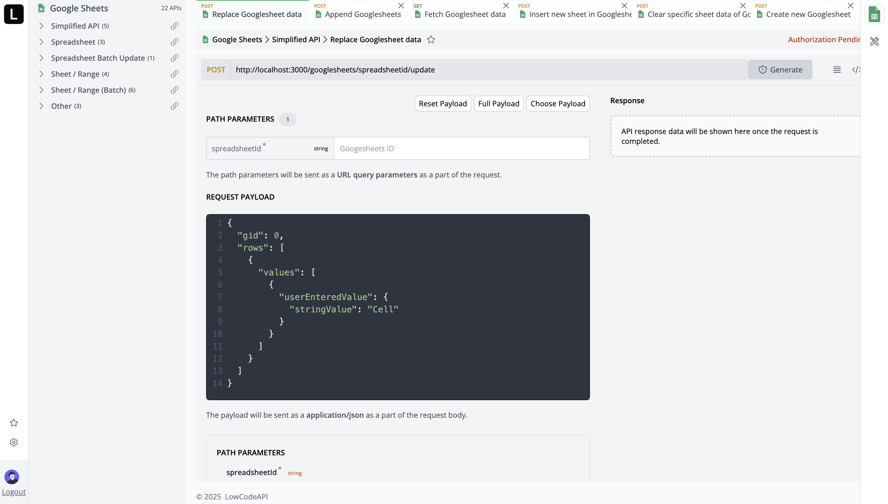

<div align="center">
  <a href="https://github.com/samal/lowcodeapi">
   
  </a>
  <h3 align="center">LowCodeAPI</h3>
  <p align="center">A unified API connector for third-party service integrations.</p>
  <div align="center">
    <a href="https://github.com/samal/lowcodeapi/blob/main/LICENSE">
      
    </a>
    <a href="https://github.com/samal/lowcodeapi/graphs/contributors">
      
    </a>
  </div>
</div>

### Overview

LowCodeAPI has two main components:

- **[🚀 Server](./server/README.md)** - Backend with unified API gateway
- **[🎨 UI](./ui/README.md)** - Frontend

### Architecture

```
┌─────────────────┐    ┌─────────────────┐    ┌─────────────────┐
│   Frontend UI   │    │  Backend API    │    │ Third-party     │
│   (Next.js)     │◄──►│   (Node.js)     │◄──►│   Services      │
│   Port: 3000    │    │   Port: 3456    │    │                 │
└─────────────────┘    └─────────────────┘    └─────────────────┘
```

## Getting started

To get a copy up and running, please follow these simple steps.

### Prerequisites

- Node.js (Version: >=18.x)
- MySQL (Version: >=8.x)
- Npm

Follow [How to start](./guide/how-to-start.md) guide here.

### Developer Documentation

- **[Server](./server/README.md)** - Backend setup, API endpoints, and development
- **[UI](./ui/README.md)** - Frontend development, components, and deployment
- Database tables [TBA]
- Docker [TBA]

### Contributors

<a href="https://github.com/samal/lowcodeapi/graphs/contributors">
  
</a>

Please see our [Contributing Guide](./CONTRIBUTING.md).

## License

See [LICENSE](./LICENSE) for more information.

## Support

- **Issues**: [GitHub Issues](https://github.com/samal/lowcodeapi/issues)
