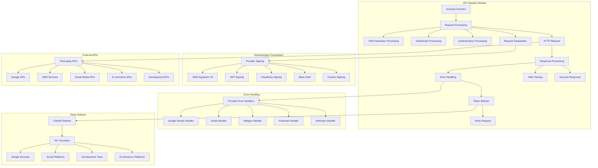
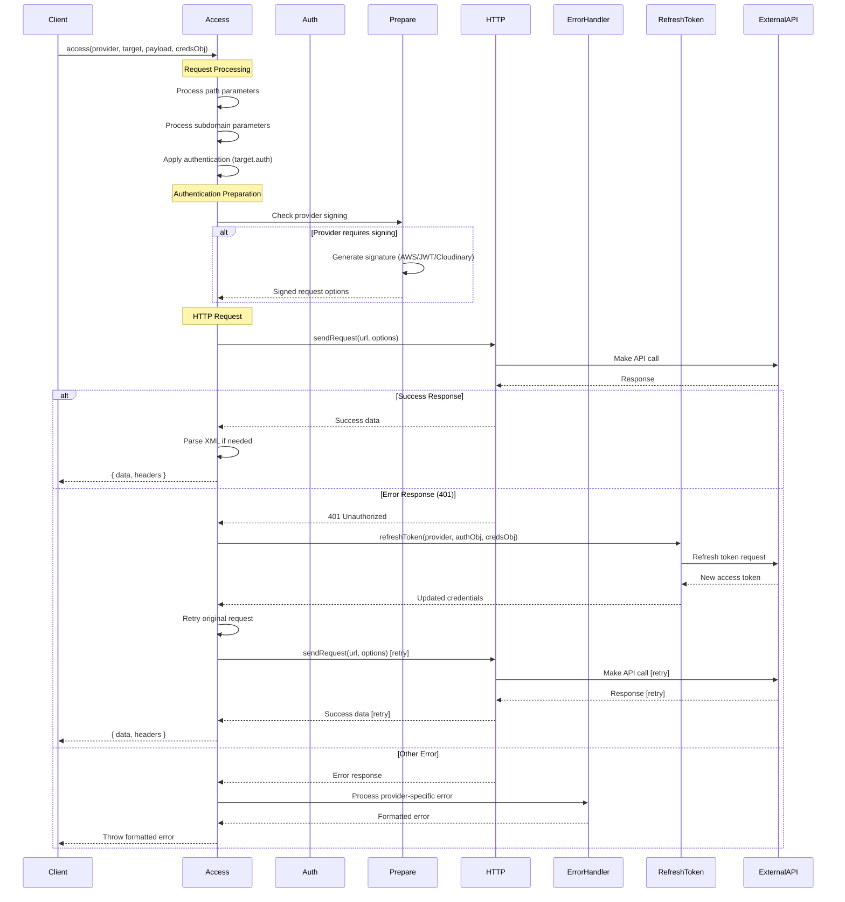
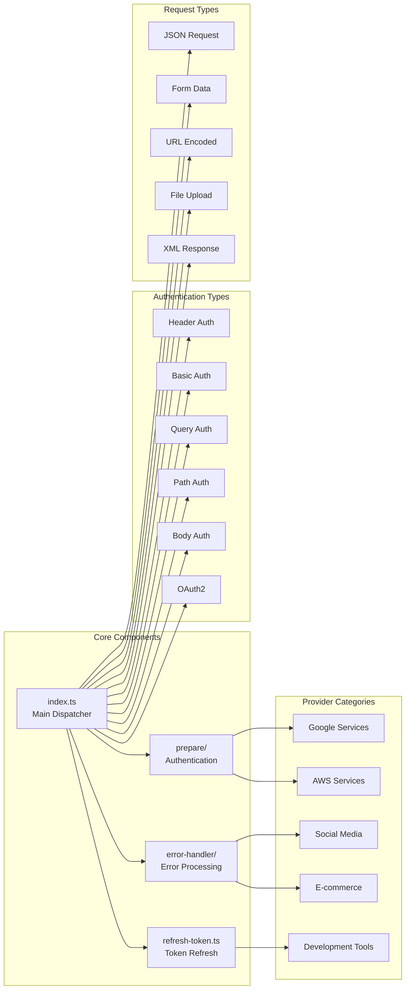
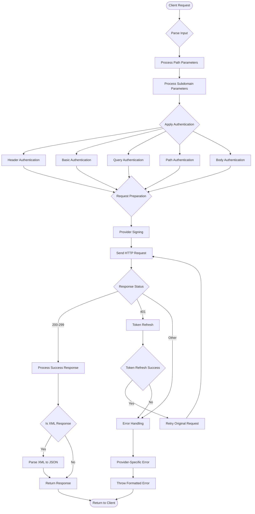
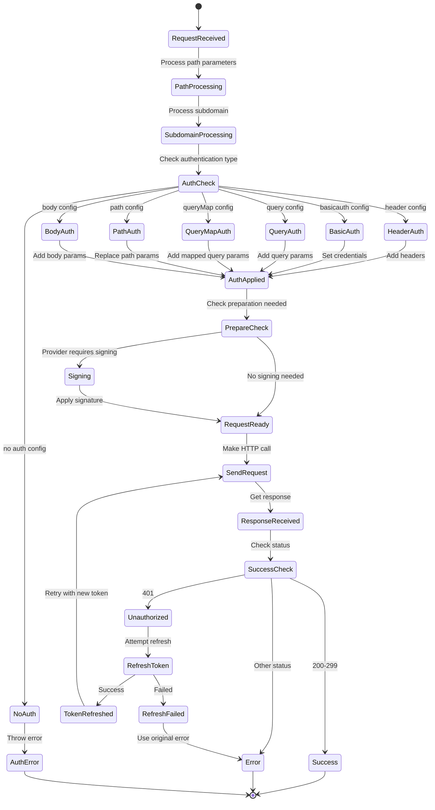
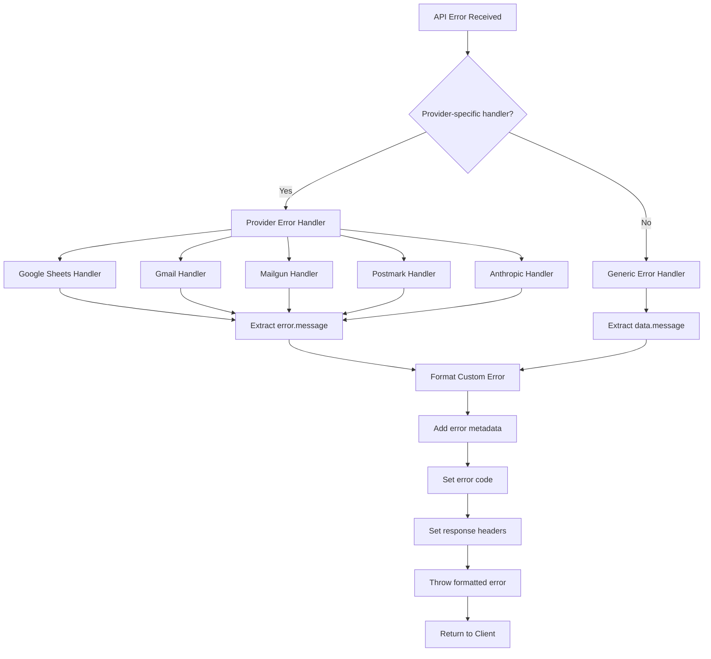

# API Dispatch Module Architecture

## System Architecture Diagram



## Request Flow Diagram



## Component Interaction Diagram



## Data Flow Diagram



## Authentication Flow Diagram



## Error Handling Flow



## Implementation Details

### Key Implementation Notes

1. **Provider Parameter**: The `provider` parameter is a string that identifies the service and is used to:
   - Look up provider-specific request preparation functions (`prepare[provider]`)
   - Apply provider-specific error handling (`errorHandler[provider]`)
   - Trigger OAuth token refresh for supported providers

2. **Authentication Priority**: 
   ```typescript
   const authDefault = auth; // Uses target.auth as primary
   ```

3. **Path Parameter Patterns**: Supports multiple replacement patterns:
   - `{key}` - Standard curly braces
   - `:key` - Colon prefix  
   - `<key>` - Angle brackets

4. **Subdomain Processing**: Handles both `subdomain` and `domain_params` configurations

5. **Request Preparation**: Only applies provider-specific signing if the provider has a preparation function:
   ```typescript
   if (prepare[provider] && typeof prepare[provider] === 'function') {
     // Apply provider-specific signing
   }
   ```

6. **Error Handling**: 
   - Automatic token refresh on 401 errors with retry mechanism
   - Provider-specific error processing if available:
   ```typescript
   if (errorHandler[provider]) {
     error = errorHandler[provider](err, provider);
   } else {
     error = new Error(data.message || `Error received from the ${provider} API`);
   }
   ```

7. **XML Response Parsing**: Automatically converts XML responses to JSON format

8. **Provider Usage Patterns**: The provider string is used as a key in three different handler objects:
   - `prepare[provider]` - Request preparation/signing functions
   - `errorHandler[provider]` - Error processing functions  
   - `refreshToken({ provider, ... })` - OAuth token refresh

### File Structure

```
api-dispatch/
├── index.ts              # Main dispatcher with access() function
├── prepare/
│   └── index.ts          # Provider-specific request signing
├── error-handler/
│   └── index.ts          # Provider-specific error processing
├── refresh-token.ts      # OAuth token refresh (re-exports from oauth/)
└── README.md            # Module documentation
```

This architecture documentation provides a comprehensive view of how the API Dispatch module works, including the flow of requests, error handling, authentication, and token refresh mechanisms.
